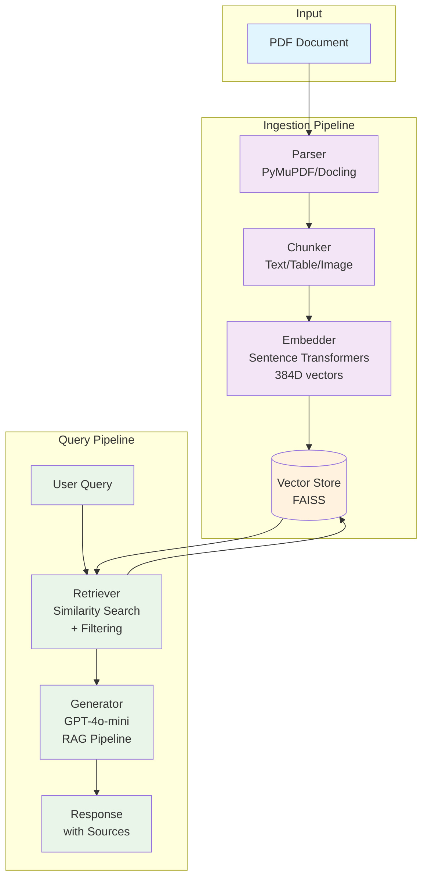

## Multimodal RAG System

A comprehensive retrieval-augmented generation (RAG) system for processing PDF documents containing text, tables, and images. Features both a REST API and an interactive web interface for easy querying.

## Problem Statement
## Domain Identification

This project is situated in the domain of electric mobility and automotive user guidance, with a focus on assisting electric vehicle (EV) drivers in understanding and utilizing technical information effectively. As EV adoption continues to grow globally, drivers increasingly rely on a wide range of documentation such as user manuals, charging guides, battery specifications, government policy documents, and maintenance handbooks. These documents are typically distributed in PDF format and contain a mix of textual explanations, structured tables, and visual diagrams.

## Problem Description

Electric vehicle drivers often face difficulty in extracting relevant information from complex and lengthy documents. For example, an EV user manual may include:

- Textual descriptions explaining battery usage, driving modes, and safety instructions
- Tables detailing charging times under different conditions, battery capacities, and efficiency metrics
- Diagrams illustrating charging setups, dashboard indicators, or energy flow systems

When a driver needs quick answers—such as “How long will it take to charge my vehicle using a fast charger?” or “What does this dashboard warning symbol mean?”—they must manually navigate through hundreds of pages of documentation. Traditional keyword-based search tools are insufficient because:

- They fail to interpret structured tables effectively
- They cannot extract meaning from diagrams or images
- They lack contextual understanding of EV-specific terminology

This results in poor user experience, slower decision-making, and in some cases, incorrect interpretation of critical vehicle information.

## Why This Problem Is Unique

Unlike generic document question-answering systems, the EV driver assistance problem involves several unique challenges:

1. Multimodal Information Dependency
Important information is distributed across multiple modalities. For example, charging times may be presented in tables, while charging procedures are explained in text, and connector types are shown in diagrams.
2. Domain-Specific Terminology
EV documentation includes specialized terms such as state of charge (SoC), regenerative braking, battery management system (BMS), and charging levels (Level 1, Level 2, DC fast charging), which require contextual understanding.
3. Real-Time Information Needs
Drivers often require quick, precise answers while making decisions, such as choosing a charging method or interpreting a warning indicator.
4. Cross-Modal Reasoning
Some queries require combining information from different sources. For example, understanding a charging diagram may require correlating it with a table listing compatible connectors and textual safety instructions.
5. User-Centric Querying
Drivers typically ask natural language questions rather than searching using exact keywords, making traditional retrieval systems ineffective.

## Why RAG Is the Right Approach

A Retrieval-Augmented Generation (RAG) system is particularly well-suited to address these challenges:

- Multimodal Retrieval Capability
By converting text, tables, and image summaries into embeddings, the system can retrieve relevant information regardless of its original format.
- Context-Aware Responses
RAG enables the system to generate answers grounded in retrieved document content, ensuring accuracy and relevance.
- No Need for Continuous Model Retraining
EV technologies and documentation evolve frequently. RAG allows new documents to be ingested dynamically without retraining the model.
- Explainability and Traceability
The system can provide references (such as page number and content type), allowing users to verify the source of information.
- Improved User Experience
Drivers can interact with the system using natural language queries and receive concise, understandable answers without manually browsing documents.

Compared to alternatives such as fine-tuning or keyword search, RAG provides a scalable, flexible, and domain-adaptive solution for handling diverse and evolving EV documentation.

## Expected Outcomes

The proposed system aims to enable EV drivers to efficiently access and understand critical information from multimodal documents. A successful system will:

- Allow users to ask natural language questions related to EV usage, charging, and maintenance
- Retrieve and combine relevant information from:
  - Text (instructions and explanations)
  - Tables (charging times, specifications)
  - Images (diagrams, dashboard symbols)
- Provide accurate, concise, and context-aware answers with source references

Example queries supported by the system include:

- “What is the charging time for my EV using a fast charger?”
- “What does this battery warning symbol indicate?”
- “Which charging connector is compatible with this vehicle?”
- “Summarize the charging specifications table on page 5”

Ultimately, this system will enhance the EV ownership experience by reducing information retrieval time, improving understanding of technical content, and supporting better decision-making for drivers.

## ✨ Features

- **Multimodal Document Processing**: Extracts and processes text, tables, and images from PDFs
- **Vision Language Model Integration**: Uses GPT-4o-mini to generate descriptions of images
- **Advanced Chunking**: Separates content by type (text, table, image) for better retrieval
- **Vector Storage**: Uses FAISS for efficient similarity search
- **Custom RAG Pipeline**: Enhanced prompt templates for grounded, accurate answers
- **Interactive Web Interface**: User-friendly browser interface for querying
- **RESTful API**: Complete FastAPI-based endpoints for ingestion and querying
- **Content Type Filtering**: Query specific content types (text, tables, images)
- **Real-time Statistics**: Monitor vector store and processing status

## �️ Setup Instructions

Follow these step-by-step instructions to set up and run the Multimodal RAG System on your local machine.

### Prerequisites

Before you begin, ensure you have the following installed:

- **Python 3.8+**: The system requires Python 3.8 or higher
- **Git**: For cloning the repository
- **OpenAI API Key**: Required for LLM and vision processing features

You can check your Python version with:
```bash
python --version
```

### Step 1: Clone the Repository

Clone the repository to your local machine:

```bash
git clone https://github.com/octjoy08-cloud/Assign-RAG.git
cd Assign-RAG
```

### Step 2: Set Up Python Environment (Recommended)

Create and activate a virtual environment to isolate dependencies:

```bash
# Create virtual environment
python -m venv rag_env

# Activate virtual environment
# On Windows:
rag_env\Scripts\activate
# On macOS/Linux:
source rag_env/bin/activate
```

### Step 3: Install Dependencies

Install all required Python packages:

```bash
pip install -r requirements.txt
```

This will install:
- **FastAPI & Uvicorn**: Web framework and server
- **PyMuPDF & Docling**: PDF parsing and document processing
- **Sentence Transformers**: Text embedding model
- **FAISS**: Vector similarity search
- **OpenAI**: LLM and vision API client
- **Pillow**: Image processing

### Step 4: Configure Environment Variables

1. **Copy the environment template**:
   ```bash
   cp .env.example .env
   ```

2. **Edit the `.env` file** with your OpenAI API key:
   ```bash
   # Open .env in your text editor
   nano .env  # or use any text editor
   ```

3. **Add your OpenAI API key**:
   ```
   OPENAI_API_KEY=your_openai_api_key_here
   PROCESS_IMAGES=true
   ```

   > **Security Note**: Never commit your `.env` file to version control. It's already included in `.gitignore`.

### Step 5: Run the Application

Start the FastAPI server:

```bash
uvicorn main:app --reload --host 0.0.0.0 --port 8003
```

You should see output similar to:
```
INFO:     Will watch for changes in these directories: ['/workspaces/Assign-RAG']
INFO:     Uvicorn running on http://0.0.0.0:8003 (Press CTRL+C to quit)
INFO:     Started reloader process [XXXX] using StatReload
```

### Step 6: Verify Installation

1. **Check the web interface**:
   Open your browser and navigate to: http://localhost:8003/

2. **Test the API health endpoint**:
   ```bash
   curl http://localhost:8003/health
   ```

   Expected response:
   ```json
   {
     "status": "running",
     "configuration": {
       "process_images": true,
       "openai_available": true
     }
   }
   ```

3. **Check vector store statistics**:
   ```bash
   curl http://localhost:8003/stats
   ```

   Expected response (initially empty):
   ```json
   {
     "total_chunks": 0,
     "chunk_types": {},
     "vector_dimension": 384
   }
   ```

### Troubleshooting

#### Common Issues:

**"Module not found" errors**:
- Ensure you're in the virtual environment: `source rag_env/bin/activate`
- Reinstall dependencies: `pip install -r requirements.txt`

**"Address already in use" error**:
- Change the port: `uvicorn main:app --reload --host 0.0.0.0 --port 8004`

**OpenAI API errors**:
- Verify your API key in `.env` file
- Check your OpenAI account has sufficient credits
- Ensure the key has the correct format (starts with `sk-`)

**Permission errors on Linux/Mac**:
- Make the virtual environment activation script executable: `chmod +x rag_env/bin/activate`

### Next Steps

Once the system is running, you can:

1. **Upload documents** using the web interface or API
2. **Ask questions** about the uploaded content
3. **Explore the API endpoints** for programmatic access
4. **Customize the system** by modifying the source code

## 📖 Usage

### Web Interface (Recommended)
1. **Upload Documents**: Click "Choose File" and select a PDF
2. **Process**: Click "Upload & Process" to extract chunks
3. **Query**: Type questions in the query box
4. **Choose Mode**:
   - **RAG Query**: Get AI-generated answers with sources
   - **Retrieve Chunks**: Get raw relevant document chunks

### API Usage

#### Document Ingestion
```bash
# Upload and process a PDF
curl -X POST "http://localhost:8003/ingest" -F "file=@document.pdf"
```

#### Query with RAG
```bash
# Ask questions with AI-generated answers
curl -X POST "http://localhost:8003/query?q=What are the benefits of electric vehicles?"
```

#### Advanced Querying
```bash
# Query specific content types
curl -X POST "http://localhost:8003/query_by_type" \
  -H "Content-Type: application/json" \
  -d '{"q": "What tables show cost data?", "chunk_type": "table"}'

# Retrieve raw chunks without generation
curl -X POST "http://localhost:8003/retrieve?q=charging stations&k=5"
```

#### System Management
```bash
# Get system health and status
curl http://localhost:8003/health

# Get vector store statistics
curl http://localhost:8003/stats

# Clear all data
curl -X DELETE http://localhost:8003/clear
```

## 📋 API Documentation

This section provides comprehensive documentation for all API endpoints with sample requests and responses.

### System Health & Status

#### `GET /health`
Check system status and configuration.

**Response:**
```json
{
  "status": "running",
  "configuration": {
    "process_images": true,
    "openai_available": true
  },
  "total_chunks": 0,
  "chunk_types": {},
  "vector_dimension": 384
}
```

**Example:**
```bash
curl http://localhost:8003/health
```

### Document Ingestion

#### `POST /ingest`
Upload and process a PDF document for ingestion into the vector store.

**Request:**
- **Content-Type**: `multipart/form-data`
- **Body**: PDF file upload

**Parameters:**
- `file` (required): PDF file to upload

**Response (Success):**
```json
{
  "message": "Document ingested successfully",
  "chunks": 45,
  "chunk_types": {
    "text": 32,
    "table": 8,
    "image": 5
  }
}
```

**Response (Error):**
```json
{
  "error": "No content extracted from document"
}
```

**Example:**
```bash
curl -X POST "http://localhost:8003/ingest" \
  -F "file=@document.pdf"
```

### Querying & Retrieval

#### `POST /query`
Ask questions with RAG (Retrieval-Augmented Generation) - retrieves relevant chunks and generates AI-powered answers.

**Request:**
- **Content-Type**: `application/x-www-form-urlencoded` or query parameters

**Parameters:**
- `q` (required): Question to ask
- `chunk_types` (optional): Comma-separated list of chunk types to filter by (`text`, `table`, `image`)
- `include_sources` (optional): Include detailed source information (`true`/`false`, default: `true`)

**Response:**
```json
{
  "answer": "Electric vehicles typically use lithium-ion batteries that can be charged at home using a Level 2 charger, which provides 240 volts and can fully charge most EVs in 4-8 hours.",
  "sources": [
    {
      "content": "Level 2 charging provides 240 volts at 30-40 amps, delivering 7.2-9.6 kW of power. Most EVs can be fully charged in 4-8 hours using a Level 2 charger.",
      "metadata": {
        "type": "text",
        "page": 15,
        "chunk_id": 23
      },
      "score": 0.87
    }
  ],
  "query": "How long does it take to charge an electric vehicle?",
  "filter_types": null
}
```

**Example:**
```bash
# Basic query
curl -X POST "http://localhost:8003/query" \
  -d "q=What are the benefits of electric vehicles?"

# Query with content type filtering
curl -X POST "http://localhost:8003/query" \
  -d "q=What charging times are shown in tables?" \
  -d "chunk_types=table"

# Query without sources
curl -X POST "http://localhost:8003/query" \
  -d "q=How do EV batteries work?" \
  -d "include_sources=false"
```

#### `POST /retrieve`
Retrieve relevant document chunks without AI generation - useful for getting raw content.

**Request:**
- **Content-Type**: `application/x-www-form-urlencoded` or query parameters

**Parameters:**
- `q` (required): Search query
- `chunk_types` (optional): Comma-separated list of chunk types to filter by
- `k` (optional): Number of results to return (default: 5)

**Response:**
```json
{
  "query": "charging stations",
  "results": [
    {
      "content": "Public charging stations are available at shopping centers, workplaces, and highway rest areas. Level 3 DC fast chargers can provide 50-150 miles of range in 20-30 minutes.",
      "metadata": {
        "type": "text",
        "page": 22,
        "chunk_id": 34
      },
      "score": 0.92
    },
    {
      "content": "| Charger Type | Power Output | Charge Time (0-80%) |\n|--------------|--------------|---------------------|\n| Level 1 | 1.4 kW | 20-40 hours |\n| Level 2 | 7.2 kW | 4-8 hours |\n| DC Fast | 50-150 kW | 20-30 minutes |",
      "metadata": {
        "type": "table",
        "page": 18,
        "chunk_id": 28
      },
      "score": 0.89
    }
  ],
  "filter_types": null,
  "total_results": 2
}
```

**Example:**
```bash
# Basic retrieval
curl -X POST "http://localhost:8003/retrieve" \
  -d "q=charging infrastructure" \
  -d "k=3"

# Retrieve only table content
curl -X POST "http://localhost:8003/retrieve" \
  -d "q=cost data" \
  -d "chunk_types=table" \
  -d "k=10"
```

#### `POST /query_by_type`
Query using only specific content types - convenience endpoint for targeted searches.

**Request:**
- **Content-Type**: `application/x-www-form-urlencoded` or query parameters

**Parameters:**
- `q` (required): Question to ask
- `chunk_type` (required): Content type to filter by (`text`, `table`, `image`)

**Response:** Same format as `/query` endpoint but filtered to specified content type.

**Example:**
```bash
# Query only tables
curl -X POST "http://localhost:8003/query_by_type" \
  -d "q=What are the charging specifications?" \
  -d "chunk_type=table"

# Query only images
curl -X POST "http://localhost:8003/query_by_type" \
  -d "q=What does the battery diagram show?" \
  -d "chunk_type=image"
```

### System Management

#### `GET /stats`
Get detailed statistics about the vector store and processed content.

**Response:**
```json
{
  "total_chunks": 156,
  "chunk_types": {
    "text": 98,
    "table": 34,
    "image": 24
  },
  "vector_dimension": 384,
  "total_documents": 3
}
```

**Example:**
```bash
curl http://localhost:8003/stats
```

#### `DELETE /clear`
Clear all data from the vector store - removes all ingested documents and chunks.

**Response:**
```json
{
  "message": "Vector store cleared successfully"
}
```

**Example:**
```bash
curl -X DELETE http://localhost:8003/clear
```

### Error Responses

All endpoints may return error responses in the following format:

```json
{
  "error": "Error message description",
  "detail": "Additional error details (optional)"
}
```

**Common HTTP Status Codes:**
- `200`: Success
- `400`: Bad Request (invalid parameters)
- `404`: Not Found
- `500`: Internal Server Error

### Content Types

The system processes three types of content from PDF documents:

- **`text`**: Regular document text, paragraphs, and descriptions
- **`table`**: Tabular data extracted as markdown tables
- **`image`**: Visual content with AI-generated descriptions (when `PROCESS_IMAGES=true`)

### Rate Limiting & Best Practices

- **API Rate Limits**: Respect OpenAI API limits when making frequent requests
- **File Size Limits**: PDFs should be under 50MB for optimal processing
- **Content Filtering**: Use `chunk_types` parameter to improve query relevance
- **Caching**: Consider caching frequent queries for better performance

## �️ Architecture Overview



### Data Flow

1. **Document Ingestion**:
   - PDF documents are parsed using PyMuPDF and Docling
   - Content is separated into text, table, and image chunks
   - Each chunk is embedded using Sentence Transformers (384D vectors)
   - Embeddings are stored in FAISS vector database with metadata

2. **Query Processing**:
   - User queries are embedded using the same model
   - Similarity search retrieves relevant chunks from vector store
   - Optional filtering by content type (text/table/image)
   - Retrieved chunks are passed to GPT-4o-mini for RAG generation
   - Response includes generated answer with source attribution
## 🛠️ Technology Choices

This section explains the rationale behind selecting each major component in the multimodal RAG system.

### Document Parser: PyMuPDF + Docling

**Why this choice?**
- **PyMuPDF (MuPDF)**: Lightweight, fast PDF parsing library written in C with Python bindings. Excellent for text and image extraction from PDFs without external dependencies.
- **Docling**: Advanced document layout analysis that excels at table extraction and structured content parsing. Provides better table recognition than PyMuPDF alone.
- **Combined approach**: PyMuPDF handles the core parsing while Docling enhances table and layout understanding, providing robust multimodal content extraction.

**Alternatives considered**: PDFMiner, PyPDF2 (slower, less accurate for complex layouts).

### Embedding Model: Sentence Transformers (all-MiniLM-L6-v2)

**Why this choice?**
- **384-dimensional embeddings**: Optimal balance between performance and computational efficiency for similarity search.
- **Pre-trained on diverse text**: General-purpose model that works well across different domains without fine-tuning.
- **Fast inference**: Lightweight transformer architecture enables real-time embedding generation.
- **Open-source**: No API costs, self-hosted for privacy and cost control.

**Alternatives considered**: OpenAI Ada (expensive, API-dependent), BERT variants (larger, slower).

### Vector Store: FAISS (Facebook AI Similarity Search)

**Why this choice?**
- **Optimized for similarity search**: Purpose-built for high-dimensional vector similarity with multiple distance metrics.
- **In-memory storage**: Fast retrieval for real-time applications.
- **Scalable**: Efficient indexing algorithms support large document collections.
- **Metadata filtering**: Supports filtering by content type (text/table/image) during search.
- **Python-native**: Seamless integration with the rest of the stack.

**Alternatives considered**: Pinecone (cloud-hosted, expensive), Chroma (simpler but less optimized).

### Large Language Model: GPT-4o-mini

**Why this choice?**
- **Multimodal capabilities**: Can process both text and images, enabling vision-language understanding.
- **Cost-effective**: Mini version provides excellent performance at lower cost than full GPT-4.
- **Strong reasoning**: Good at synthesizing information from multiple sources for RAG.
- **Consistent API**: Reliable OpenAI interface with good documentation.
- **Context window**: Sufficient for RAG applications with retrieved chunks + query.

**Alternatives considered**: GPT-3.5-turbo (weaker reasoning), Claude (different API), open-source models (variable quality).

### Vision Language Model: GPT-4o-mini

**Why this choice?**
- **Unified model**: Same model handles both text generation and image understanding, simplifying the architecture.
- **High-quality descriptions**: Excellent at generating detailed, contextual descriptions of images and diagrams.
- **Cost efficiency**: Single API for both text and vision tasks reduces complexity and costs.
- **Multimodal integration**: Seamlessly combines visual and textual information in RAG pipeline.

**Alternatives considered**: Separate vision models (CLIP + LLM), open-source VLMs (variable performance/cost).
## �🏗️ Architecture

```
PDF Document
├── Parser (PyMuPDF/Docling)
│   ├── Text Chunks → Sentence-based chunking
│   ├── Table Chunks → Structured table extraction
│   └── Image Chunks → Vision Model (GPT-4o-mini) → Descriptions
│
├── Embedder (Sentence Transformers - all-MiniLM-L6-v2)
│   └── Vector Embeddings (384 dimensions)
│
├── Vector Store (FAISS)
│   └── Similarity Search with metadata filtering
│
├── Query Processor
│   ├── Content Type Filtering
│   ├── Similarity Retrieval
│   └── RAG Generation with custom prompts
│
└── Web Interface (HTML/CSS/JavaScript)
    └── Interactive querying and document management
```

## 📊 Chunk Types

- **Text**: Regular document text, intelligently chunked by sentences and paragraphs
- **Table**: Tabular data extracted as structured markdown content
- **Image**: Visual content processed through GPT-4o-mini for detailed descriptions

## ⚙️ Configuration

### Environment Variables (`.env`)
```bash
OPENAI_API_KEY=your_api_key_here          # Required for LLM and vision processing
PROCESS_IMAGES=true                       # Enable/disable image processing (default: true)
```

### Dependencies
- **FastAPI**: Web framework and API
- **PyMuPDF**: PDF parsing and text extraction
- **Docling**: Advanced document layout analysis
- **Sentence Transformers**: Text embedding (384D vectors)
- **FAISS**: Vector similarity search
- **OpenAI GPT-4o-mini**: LLM for generation and vision
- **Pillow**: Image processing

## 🎯 Example Queries

### Basic Questions
- "What are the benefits of electric vehicles?"
- "How do charging stations work?"
- "What are the environmental impacts?"

### Content-Specific Queries
- "What tables show cost comparisons?" (table filter)
- "What images show battery technology?" (image filter)
- "What text discusses government policies?" (text filter)

### Advanced Retrieval
- Get raw chunks: `"charging infrastructure", k=10`
- Filtered search: `"emission standards", chunk_types="table"`

## 🔧 Development

### Project Structure
```
├── main.py                 # FastAPI application with CORS and static files
├── src/
│   ├── api/routes.py       # API endpoints and request handlers
│   ├── ingestion/
│   │   ├── parser.py       # PDF parsing and chunk extraction
│   │   ├── embedder.py     # Text embedding with Sentence Transformers
│   │   └── chunker.py      # Text chunking utilities
│   ├── retrieval/
│   │   ├── vector_store.py # FAISS vector storage and search
│   │   └── retriever.py    # Query processing and retrieval logic
│   └── models/
│       ├── llm.py          # OpenAI integration for RAG generation
│       └── vision.py       # Image description with GPT-4o-mini
├── static/
│   └── index.html          # Web interface
├── requirements.txt        # Python dependencies
├── .env.example           # Environment configuration template
└── README.md              # This file
```

### Running Tests
```bash
# Test API endpoints
curl http://localhost:8002/health

# Test document ingestion
curl -X POST -F "file=@test.pdf" http://localhost:8002/ingest

# Test querying
curl "http://localhost:8002/query?q=What is this document about?"
```

## 🚨 Troubleshooting

### Common Issues

**"Failed to fetch" Error**
- Ensure CORS is enabled (automatically configured)
- Check that server is running on correct port (8002)
- Verify browser is accessing http://localhost:8002/

**Document Processing Fails**
- Check PDF file is not corrupted
- Ensure sufficient disk space for processing
- Verify OpenAI API key is configured

**No Search Results**
- Confirm documents have been ingested
- Check vector store statistics: `GET /stats`
- Try different query terms

**Image Processing Disabled**
- Set `PROCESS_IMAGES=true` in `.env`
- Ensure OpenAI API key has sufficient credits
- Images will fallback to filename-only descriptions if VLM fails

### Logs and Debugging
- Server logs appear in terminal when running with `--reload`
- Check browser developer console for frontend errors
- API responses include detailed error messages

## 📄 License

This project is for educational and research purposes.

---
## ⚠️ Limitations & Future Work

This section provides an honest assessment of the system's current limitations and potential improvements.

### Current Limitations

#### Technical Constraints
- **Memory Limitations**: FAISS vector store is in-memory only, limiting document collection size
- **API Dependency**: Heavy reliance on OpenAI API creates cost and rate limiting issues
- **Processing Speed**: Large PDF documents take significant time to process and embed
- **Single-User Architecture**: Not designed for concurrent users or multi-tenancy
- **No Persistence**: All data is lost when the server restarts

#### Content Processing Issues
- **PDF Parsing Accuracy**: Complex layouts, multi-column documents, or scanned PDFs may have extraction errors
- **Table Recognition**: Struggles with complex table structures, merged cells, or irregular formatting
- **Image Quality**: Vision model descriptions depend on image clarity and may miss fine details
- **Mathematical Content**: Formulas and equations are not properly handled
- **Multi-Language Support**: Primarily optimized for English content

#### RAG System Limitations
- **Hallucination Risk**: Like all LLM systems, can generate incorrect information
- **Context Window**: Limited by GPT-4o-mini's context window (retrieved chunks may be truncated)
- **No Conversation Memory**: Each query is independent, no follow-up question capability
- **Domain Specificity**: While trained on general knowledge, may lack deep domain expertise
- **Source Attribution**: May occasionally misattribute information to wrong sources

#### User Experience Issues
- **No Progress Indicators**: Long operations (document ingestion) provide no feedback
- **Limited Error Messages**: Generic error responses don't help users troubleshoot issues
- **No Query History**: Users cannot review or refine previous queries
- **Basic Web Interface**: Functional but not optimized for complex workflows

### Future Improvements

#### High Priority
- **Persistent Storage**: Implement database backend (PostgreSQL + pgvector) for data persistence
- **Better Vector Database**: Migrate to scalable solutions like Pinecone, Weaviate, or Qdrant
- **Concurrent Processing**: Add async processing for multiple users and large documents
- **Progress Tracking**: Real-time progress indicators for long-running operations
- **Conversation Memory**: Implement chat history and follow-up question support

#### Medium Priority
- **Advanced Chunking**: Implement semantic chunking, hierarchical chunking, and overlap strategies
- **Multi-Modal Models**: Integrate models like GPT-4V or LLaVA for better image understanding
- **Hybrid Search**: Combine semantic search with keyword-based retrieval
- **Query Expansion**: Add query rewriting and expansion for better retrieval
- **Result Re-ranking**: Implement cross-encoders for better result ordering

#### Long-term Vision
- **Multi-Language Support**: Expand to handle documents in multiple languages
- **Domain Adaptation**: Fine-tune models on specific domains (automotive, legal, medical)
- **Advanced Table Processing**: Better handling of complex tables and data relationships
- **Mathematical Reasoning**: Support for formulas, equations, and technical calculations
- **Collaborative Features**: Multi-user document collections and shared knowledge bases
- **API Rate Limiting**: Implement intelligent caching and request optimization
- **Model Distillation**: Create smaller, faster models for common use cases

#### Performance Optimizations
- **Embedding Caching**: Cache embeddings to avoid re-processing unchanged content
- **Incremental Updates**: Support for partial document updates rather than full reprocessing
- **Batch Processing**: Optimize for bulk document ingestion
- **GPU Acceleration**: Leverage GPU for faster embedding generation
- **Edge Deployment**: Enable local deployment without cloud dependencies

#### User Experience Enhancements
- **Advanced Web Interface**: Modern UI with drag-and-drop, progress bars, and query history
- **API SDKs**: Provide client libraries for Python, JavaScript, and other languages
- **Export Features**: Allow users to export results, citations, and processed documents
- **Analytics Dashboard**: Usage statistics, performance metrics, and system health monitoring
- **Integration APIs**: Connect with external tools (Slack, Notion, document management systems)

### Contributing
We welcome contributions! If you're interested in addressing any of these limitations, please:
1. Check existing issues or create a new one
2. Discuss your approach in the issue comments
3. Submit a pull request with your improvements

---
**Ready to explore your documents?** Start the server and open http://localhost:8002/ in your browser! 🎉

## RAG Prompt Template

The system uses a custom prompt template that:
- Provides clear instructions for grounded answers
- Handles different content types appropriately
- Includes source attribution
- Maintains technical accuracy for engineering content</content>
<parameter name="filePath">/workspaces/Assign-RAG/README.md
